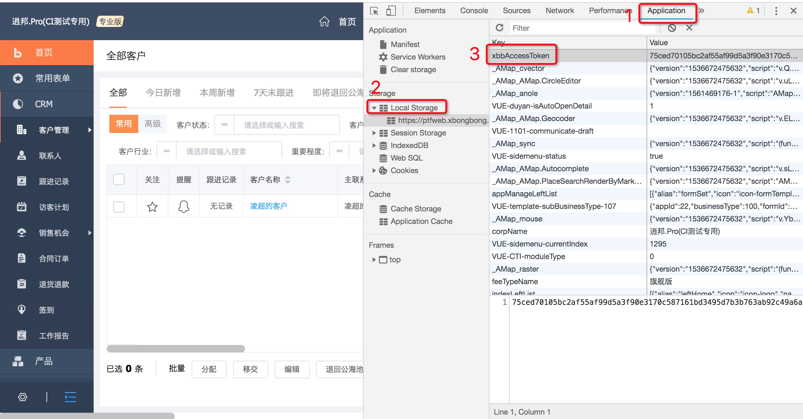

xbb-pro-api-testing

# 项目安装及运行
1.安装依赖:
    pip install -r requirements.txt
2.登录系统，从浏览器Application->LocalStorage里面获取Token(目前先这样)

3.拷贝Token粘贴到conf.ini对应环境token中
3.运行测试方法:
    pytest test_run_pro_api.py

# MongoDB相关操作
* 清空实际保存的请求数据:
```sql
db.api_request_case.update(                            
   {},
   {$set:{ "actual_result":{}}},  
   false,  
   true  
)
```
* api_request_case中case_name增加唯一索引
```sql
db.api_request_case.createIndex({case_name:1},{unique:true})
```
* Mongo正则删除(删除不以auto开头的)
```
db.api_request_case_temp.remove({case_name:{$regex:"^(?!auto)"}})
```
* request_case请求体里面加上frontDev:1跳过sign校验
```
db.api_request_case.update(                            
   {},
   {$set:{ "request_param.frontDev":NumberInt(1)}},
   false,  
   true  
)
```
# 当前表结构字段说明 
apicase
cid : case_id, 如"get_all_customer_on_web" 
method : "post",
url : "/list/customer",
comment : 简单说明,如"查询全部客户列表"，可不填
api_type : "web" 或 "app"，必填
business_module" : 所属业务模块，可不填

# 添加接口数据
直接从Chrome网络里request raw拷贝到request_case里。


参考资料:
[mongoengine](http://docs.mongoengine.org/)
[mitmproxy](https://docs.mitmproxy.org/)
[使用mitmproxy+python做拦截代理](https://blog.wolfogre.com/posts/usage-of-mitmproxy/)